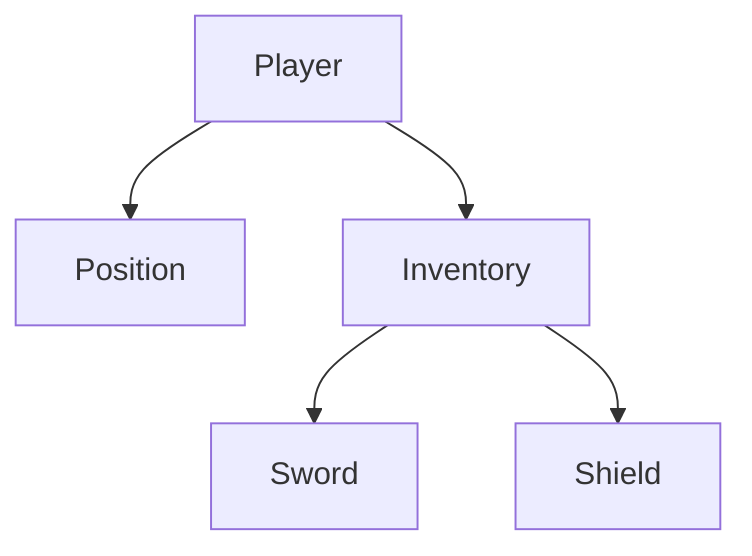

# PicoECS

PicoECS is a fast, thread-safe, and simple way to store and find entities in your .NET applications. It is designed to handle hierarchical data—where objects are naturally nested, like items in an inventory, UI elements in a tree, or objects in a game scene.

## Why PicoECS?

- **Hierarchy-First:** Easily link entities as parents and children. Removing a parent automatically cleans up all its descendants.
- **Thread-Safe:** Built-in support for multiple threads reading and writing at the same time using `ReaderWriterLockSlim`.
- **Fast:** Find entities by their unique ID in O(1) time or query all entities of a specific type instantly.
- **Simple API:** No complex setup. Just inherit from `Entity` and start using the `PicoStore`.

## Getting Started

### 1. Define Your Entities

Entities are just classes that inherit from `Entity`.

```csharp
public class Player : Entity { public string Name { get; set; } = "Hero"; }
public class Position : Entity { public float X, Y; }
public class Item : Entity { public string Name { get; set; } = "Sword"; }
```

### 2. Basic Usage

```csharp
using PicoECS;

// Create the store
var store = new PicoStore();

// Add entities and establish a hierarchy
var player = new Player();
var pos = new Position { X = 10, Y = 20 };

// 'pos' becomes a child of 'player'
store.Add(player, pos);
```

### Creating a Hierarchy

PicoECS manages nested entity relationships. For example, a Player can own an Inventory that contains various Items:

```csharp
// create the store
var store = new PicoStore();

// initialize your entities
var player = new Player();
var inventory = new Inventory();
var position = new Position();
var sword = new Sword();
var shield = new Shield();

// add player to the store with inventory and position as a children
store.Add(player, inventory, position);

// add sword to the store with inventory as the parent
store.Add(inventory, sword, shield);
```
#### Created Hierarchy

#### Querying the Hierarchy
```csharp
var player = store.GetFirst<Player>();
var inventory = store.GetChild<Inventory>(player).First();
var sword = store.GetChild<Sword>(inventory).First();

// Removing an entity recursively removes all of the entity's descendants
store.Remove(player); 
```

### 3. Using ForEach

You can quickly run code on every entity of a certain type without creating a new list.

```csharp
// Run an action on every Position entity
store.ForEach<Position>(p => {
    p.X += 1.0f;
    Console.WriteLine($"Moved to {p.X}, {p.Y}");
});

// Or run it on every single entity in the store
store.ForEach(e => Console.WriteLine($"Entity ID: {e.Id}"));
```

## Querying

### Multiple Types
If you need entities of several different types at once, you can pass them as parameters:
```csharp
var results = store.GetAll(typeof(Player), typeof(Item));
```

### Descendants
Get every entity nested under a parent:
```csharp
var allDescendants = store.GetDescendants(player);
```

## More Examples

For a full look at the API, check out the test suite:
👉 **[PicoECS.Tests/StoreApiTests.cs](./PicoECS.Tests/StoreApiTests.cs)**

## License

This project is licensed under the MIT License - see the [LICENSE](LICENSE) file for details.
